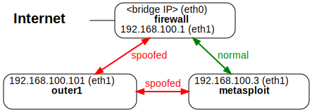

ARP Spoofer and Detector
=================

[Go up to the NWS HW page](../index.html) ([md](../index.md))

### Overview

In this assignment you will...

This assignment is to be done in Python, and uses the `scapy` library.  If you are developing it on your own computer, you should install scapy via pip (or pip3): `pip install scapy`.

You will be submitting one code file as well as [arp.py](arp.py.html) ([src](arp.py)).


### Changelog

Any changes to this page will be put here for easy reference.  Typo fixes and minor clarifications are not listed here.  So far there aren't any significant changes to report.


### Built-in Commands

There are a few commands installed that we are going to use.

#### `arp`

`arp` will allow us to see and manipulate the contents of the ARP cache.  Running `arp -a` will display the cache:

```
root@outer1:/# arp -a
outer2 (192.168.100.102) at 02:42:c0:a8:64:66 [ether] on eth0
metasploit (192.168.100.3) at 02:42:c0:a8:64:03 [ether] on eth0
gateway (192.168.100.2) at 02:42:c0:a8:64:02 [ether] on eth0
firewall (192.168.100.1) at 02:42:c0:a8:64:01 [ether] on eth0
outer3 (192.168.100.103) at 02:42:c0:a8:64:67 [ether] on eth0
root@outer1:/# 
```

If you just connected to that container, there may be nothing in the ARP cache.  Run `ping -c 1 <host>` on a few hosts (`outer1`, `outer2`, `gateway`, `inner`, etc.).  The ping process will obtain the ARP mapping; running the `arp -a` command again will now show entries in the cache.

You can clear entries in the cache via `-d`: `arp -d <ipaddr>`.  If you are running this on your own machine, you will have to put `sudo` before it to run it as the super-user.  The entries have to be deleted one at a time.

#### `netdiscover` and `arp-scan`

`netdiscover` will query all the hosts on the sub-net, and display their MAC addresses and IP addresses.  However, it does *not* populate the ARP cache.  And then it will send out ARP requests to all the hosts on all other sub-nets -- this can take quite some time.  We can limit that to a given sub-net via the `-r` argument: `-r 192.168.100.0/24`.

Here's an execution run on `outer1`:

```
root@outer1:/# netdiscover -r 192.168.100.0/24 -P
 _____________________________________________________________________________
   IP            At MAC Address     Count     Len  MAC Vendor / Hostname      
 -----------------------------------------------------------------------------
 192.168.100.1   02:42:c0:a8:64:01      1      42  Unknown vendor
 192.168.100.2   02:42:c0:a8:64:02      1      42  Unknown vendor
 192.168.100.3   02:42:c0:a8:64:03      1      42  Unknown vendor
 192.168.100.102 02:42:c0:a8:64:66      1      42  Unknown vendor
 192.168.100.103 02:42:c0:a8:64:67      1      42  Unknown vendor

-- Active scan completed, 5 Hosts found.
root@outer1:/# 
```

In the example shown, the `-P` option was added that improves formatting for this assignment -- you probably won't want to use the `-P` option when you run it.

`arp-scan` works similarly: it will send ARP requests to the hosts, but not populate the ARP cache.  Using the `-l` option (`arp-scan -l`) will only scan the local network.


### ARP Spoofing

We are going to execute two different ARP spoofing attacks.  Before each of them, you may want to clear the ARP cache via `arp -d`, as explained above.

#### Basic ARP spoofing attack

The first task is to experiment with the `arpspoof` command that is already installed on the Docker images.  This part will go through the same steps that were [gone over in the lecture slides](../../slides/link-layer.html#/arpexample), which are repeated here.

We will be using the [course Docker setup](../../docker/network.svg), and will be changing first image (normal operation) to the second image (spoofed operation).


<br clear='all'>

Load up 5 tabs:

- Tab 1: run the docker setup: `docker-compose up`
- Tab 2: connect to outer1 and run:`arpspoof -i eth0 -t 192.168.100.102 192.168.100.1`
- Tab 3: connect to outer1 and run: `arpspoof -i eth0 -t 192.168.100.1 192.168.100.102`
  - Note that the IP addresses are reversed!
- Tab 4: connect to outer1 and run: `urlsnarf -i eth0`
  - This will display URLs it sees in the intercepted packets
- Tab 5: wait a minute, then connect to *outer2* and run: `wget -q http://google.com`

At this point, you should see the URL chosen (`http://google.com`) output by the `urlsnarf` program.

When running `wget` from outer2, any `http://` address will appear in the `urlsnarf` output, but there is often a few seconds of delay.

Notice that an `https://` address will *not* appear in the `urlsnarf` output -- the packet is encrypted with AES, so `urlsnarf` cannot see that it's a URL request therein.


#### MITM ARP spoofer

Next we are going to execute the MITM (in-the-middle) attack via an ARP spoof; this is [as shown in the slides as well](../../slides/link-layer.html#/mitmarp).  We are going to ARP spoof *metsploit* via *outer1*.


<br clear='all'>

- First, turn off IP forwarding: `echo 0 > /proc/sys/net/ipv4/ip_forward`
- Clear out the ARP cache, via `arp -d`, as explained above
- Run `arpspoof` in two terminals on *outer1*.
  - `arpspoof -i eth1 -t 192.168.100.3 192.168.100.1`
  - `arpspoof -i eth1 -t 192.168.100.1 192.168.100.3`
- Download the [arp_mitm.py](../../slides/code/arp_mitm.py.html) ([src](../../slides/arp_mitm.py)) file
- Run that file on *outer1*
- Connect to *firewall* via `docker exec`.  If you connect via `ssh`, then that will (correctly) populate the ARP cache, negating our hack.
- From *firewall*, ssh into metasploit (`ssh msfadmin@metasploit`, password is `msfadmin`).
- Type `echo foo` into the terminal.  The response will be `bar`.

### Packet interception

We are going to use the [scapy](https://scapy.net) Python library to intercept all packets.  For this part, we are not modifying the packets.  We saw something similar in the [arp_mitm.py](../../slides/code/arp_mitm.py.html) ([src](../../slides/arp_mitm.py)) from above:

```
def spoof_pkt(pkt):
  # code omitted from this listing, but in the original file

filter = "tcp and (ether src " + FIREWALL_MAC + " or ether src " + VICTIM_MAC + ")"
pkt = sniff(iface='eth1', filter=filter, prn=spoof_pkt)
```

Notes:

- The `spoof_pkt()` is passed the packet by the `sniff()` function.
- The `filter` parameter to `sniff` is a (mostly) English description of what packets the function (via the `prn` parameter) should be called on.  To sniff all arp packets, use 'arp' as the filter.  The full description of the filter language can be found [here](https://biot.com/capstats/bpf.html), if you are interested.
- To get a part of the filter, you pass the name of the part in as an array index: `packet['Ether']` or `packet['ARP']`, for example
- ARP packets have two source addresses, protocol (IP) and hardware (MAC), called `psrc` and `hwsrc`, respectively.  Likewise the destination filters are `pdst` and `hwdst`.
- Thus, to get the MAC address it came from, use `packet['ARP'].hwsrc`


### Spoof Detector

Having experimented with ARP spoofing, we are going to write an ARP spoofing detector.  Testing for this is described below.

The result of this part should be in a file called `arpDetector.py`.

#### Overview

Your program should do the following:

1. Read the list of ARP mappings that the computer currently has.
2. Read a file called `arp-overrides.txt` that also provides mappings.  The file may not be present -- if not, then move on to the next step.  The format of this file is described below.  The mappings in this may override what was read in the previous step -- if so, just overwrite the mapping.
3. Listen for ARP messages, and print out various messages, described below.  The output is very specific!
4. Keep running indefinitely; we'll use Ctrl-C to terminate the program.


#### Step 1: Read the interface from the first command line parameter

This is critical!  Whatever the interface is where you are testing it -- likely `en0`, `eth0`, or `eth1` -- that is NOT going to be the interface when we test it.  You are welcome to have a default if no parameter is specified.  But the first command line parameter is the interface to pass to the `iface` parameter of `sniff()`.


#### Step 2: read from system

The first step is to read in the current ARP mappings, of MAC to IP, that the computer has.  If you run `arp -a`, you will get something similar to the following:

```
root@outer1:/# arp -a
outer2 (192.168.100.102) at 02:42:c0:a8:64:66 [ether] on eth0
metasploit (192.168.100.3) at 02:42:c0:a8:64:03 [ether] on eth0
gateway (192.168.100.2) at 02:42:c0:a8:64:02 [ether] on eth0
firewall (192.168.100.1) at 02:42:c0:a8:64:01 [ether] on eth0
outer3 (192.168.100.103) at 02:42:c0:a8:64:67 [ether] on eth0
root@outer1:/# 
```

You can run this via the `subprocess` module to capture the input.  Or you can redirect to a file, then read that file (then delete that file).  You can assume that the output will be in the format described above (but without the prompts on the first and last line) -- in particular, the MAC address will be the 4th item, and the IP address will be the 2nd item.  Note that the IP address has parentheses around it.

This step should produce no output on a successful run (if the program runs into an error, then you can print out whatever output you want).

#### Step 3: read from file

Next we need to read in a file that contains mappings.  This file may not exist, or it may be empty.  Here is a sample file, which is the typical set of MAC addresses for the outer network of the docker setup.

```
# ARP spoofing file

# mappings of the hosts on the outer network in the docker setup
02:42:c0:a8:64:01 192.168.100.1
02:42:c0:a8:64:02 192.168.100.2
02:42:c0:a8:64:03 192.168.100.3
02:42:c0:a8:64:05 192.168.100.101
02:42:c0:a8:64:06 192.168.100.102
02:42:c0:a8:64:07 192.168.100.103
```

There are three types of lines:

- A comment will have the hash symbol (`#`) as the first character; in this case, ignore that line.  You only need to check the first character of a line for this symbol.
- An empty line is ignored.
- A mapping line will have two values, separated by a single space.  The first is the MAC address (either upper-case or lower-case hex), the second is the IPv4 address.

In particular, the mappings in this file may overwrite the mappings from the previous step -- this is intentional, as this can be used when testing the program.  You can assume the file, if it exists, will match the format above -- meaning it will not have errors.  Note that it can be an empty file, though, or it may not be present.

This step should also produce no output on a successful run.  If the program runs into an error, then you can print out whatever output you want.  The file not being present, or the file being empty, is not an error, and should produce no output.


#### Step 4: monitor the network

In this step, you will listen to the network for ARP messages -- use the `scapy` library, as [discussed in lecture](../../slides/arp.html#/) for this.

Your program should produce two types of output for this part:

- If a new ARP mapping is observed, the print out a line stating so:
  ```
New mapping: 192.168.100.101 -> 02:42:c0:a8:64:65
```
  This is the "mapping detector" part.
- If a ARP packet is received where the MAC and IP therein do NOT match what is in the program's mapping, the you should output the following line:
  ```
Possible ARP attack detected: 192.168.100.102 may be pretending to be 02:42:c0:a8:64:02
```
  This is the "spoofing detector" part,

As this part of the assignment will be auto-graded, you have to have that exact output.  To ensure you have the exact right output, the following functions are provided that you should use.

```
def outputNewMapping(mac,ip):
	return "New mapping: " + str(ip) + " -> " + str(mac).lower()

def outputARPConflict(mac,old_ip,new_ip):
	return "Possible ARP attack detected: " + str(old_ip) + \
		   " may be pretending to be " + str(new_ip) + \
		   " for MAC " + str(mac)
```

#### Step 5: keep running

Your program should keep running until Ctrl-C is pressed, which will terminate the program -- you don't have to put in any code to read in the Ctrl-C.

You can also send a signal to the program that is the equivalent of Ctrl-C.  First, you have to find the process number of the running program:

```
$ ps aux | grep arpDetector
```

This may print out multiple lines of processes, but one of them is going to be the process line.  (The others may be the grep line, or the `sudo` line, if you have to run it with `sudo`).  For example:

```
$ ps aux | grep arpDetector 
root             62439   0.1  0.2 409569856  63728 s001  S+    9:09AM   0:00.56 /opt/homebrew/Cellar/python@3.11/3.11.6_1/Frameworks/Python.framework/Versions/3.11/Resources/Python.app/Contents/MacOS/Python arpDetector.py
aaron            63076   0.0  0.0 408626944   1328 s004  R+    9:09AM   0:00.00 grep arpDetector
root             62436   0.0  0.0 408642048   9568 s001  S+    9:09AM   0:00.02 sudo python3 arpDetector.py
$
```

You can then send Ctrl-C to the process via:

```
$ sudo kill -SIGINT 62439
```

This is how we will be doing it in the automated testing.  Replace the process number with the one specific to your process.  Note that you don't have to include any code to handle Ctrl-C.


#### Testing

To test this, first find the IP -> MAC addresses on your local network.  You can do this from the output of `arp -a`, or from step 1 above.  You can find the mappings by running `sudo arp-scan -l`.  (Note that we did not use that for step 1, as we specifically don't want all the ARP mappings -- we want the program to be able to discover them via the ARP packets.)  This program is already installed on the docker images; you can install it under Linux via `sudo apt install arp-scan`, and on a Mac via `brew install arp-scan`.

To test the new mapping detection, run it on one of the containers.  Clear out the ARP cache via `arp -d`.  In another terminal and in the same container, ping a few other nodes from that container.  Each time, your program should print out that it found a new mapping.  Check that those IP -> MAC mappings are in the ARP cache via `arp -a`.  Then, in a *different* container, run an ARP spoof via `arpspoof`.  Your program should print out that it detected a possible ARP spoof.


#### Example output

```
root@outer1:/# arp -a
root@outer1:/# python3 arpDetector.py 
New mapping: 192.168.100.101 -> 02:42:c0:a8:64:65
New mapping: 192.168.100.103 -> 02:42:c0:a8:64:67
Possible ARP attack detected: 192.168.100.102 may be pretending to be 192.168.100.1 for MAC 02:42:c0:a8:64:66
Possible ARP attack detected: 192.168.100.102 may be pretending to be 192.168.100.1 for MAC 02:42:c0:a8:64:66
Possible ARP attack detected: 192.168.100.102 may be pretending to be 192.168.100.1 for MAC 02:42:c0:a8:64:66
^C
root@outer1:/# 
```

***NOTE:*** These are not *extensive* tests, and we will be providing more comprehensive tests when we test your program.  These two tests are mean to get you started with testing your program.


### Submission

You will be submitting your `arpDetector.py` file, as well as [arp.py](arp.py.html) ([src](arp.py)).  That arp.py file describes, in the comments, what needs to be filled in.


