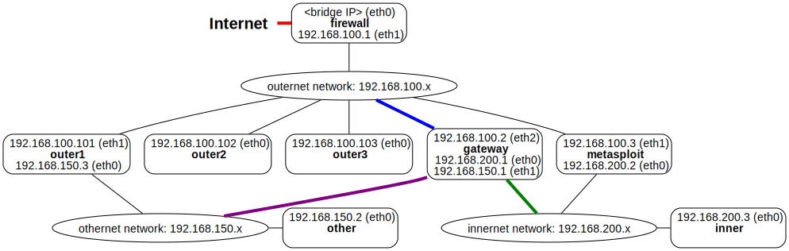

DNS Spoofing
============

[Go up to the NWS HW page](../index.html) ([md](../index.md))


### Overview

In this assignment you will be writing a number of DNS spoofs using Scapy.  You will need to be familiar with the [DNS section of the slides](../../slides/dns.html#/attacks).  Your code will be based on the examples in the [text book](https://www.amazon.com/dp/1733003967) starting at Listing 10.3 on pages 240-241.  If your text book is "unavailable", you can see that code online [here](https://github.com/kevin-w-du/BookCode/blob/master/DNS/) as well as the [DNS section of the slides](../../slides/dns.html#/attacks).

You will be submitting three source code files as well as an edited version of [dnsspoof.py](dnsspoof.py.html) ([src](dnsspoof.py)).


### Changelog

Any changes to this page will be put here for easy reference.  Typo fixes and minor clarifications are not listed here.  So far there aren't any significant changes to report.


### Troubleshooting

This section will be filled out later today (Friday, March 29th)...

### Docker setup

This assignment is intended to be run in the course Docker setup.

#### Container roles

Many of the Docker containers have been assigned roles for this assignment:

- *gateway* is the DNS server that all the containers use.  If it does not know the answer, it will query 8.8.8.8 (Google's DNS server).  It is not a malicious nameserver.  It will resolve cs4760.nws and mail.cs4760.nws to outer2, and sketchyurl.nws to outer1.
- *outer3* is a malicious nameserver.  It will resolve a number of sub-domains in \*.example.com and \*.cs4760.nws to outer1.
- *outer1* hosts a number of domain websites for mail.example.com, example.com, and sketchyurl.nws.  If any of those names resolve to the IP address of *outer1* (192.168.100.101), it will serve a web page that makes it clear it's a malicious domain.  Note that sketchyurl.nws is not malicious, but the other two are.
- *outer2* is the (valid) web server host for cs4760.nws.
- *firewall* does not host any servers, but it is where the network slow-down command (see below) must be run from.
- *inner* is where all the DNS queries must originate from.


#### Configuration

The docker containers are configured up for this lab.  Note that you will have to restart the containers if you have not done so since the assignment was released, as the containers get their updated configuration when they start.

The *gateway* container is configured as a DNS server.  The server is named bind (or bind9, as it's the 9th version of bind) of the popular [BIND](https://en.wikipedia.org/wiki/BIND) DNS server.  However, the *process* that runs on the computer is called `named` (name daemon).

We have set up a new top-level domain for this assignment, called .nws.  This TLD was chosen because it's the acronym for this class, and because as it does not exist on the Internet, there will never be any conflict with a real TLD or domain.  It's not really a TLD -- there are no TLD nameservers handling this -- but our DNS server will resolve a few URLs that end in .nws to the IP addresses that we specify.

The configuration files for this are in `/etc/bind/`; the relevant ones are:

- `/etc/bind/named.conf` is the main configuration file -- the last line tells it to read /etc/bind/named.cs4760.conf
- `/etc/bind/named.conf.options` contains the various options that are not .zone files
- `/etc/bind/named.cs4760.conf` is the configuration for this lab -- it tells named to read two .zone files
- `/etc/bind/cs4760.nws.zone` defines a zone for the cs4760.nws domain; this resolves to outer2
- `/etc/bind/sketchyurl.nws.zone` defines a zone for the sketchyurl.nws domain; this resolves to outer3

A .zone file has an oddball format, and can be generated via online tools such as [this one](https://nimmneun.com/toolbox/bind-zone-file-generator/) -- you will never be expected to generate one yourself.  But you should understand what is going on in a .zone file.  The cs4760.nws.zone file is as follows:

```
; BIND zonefile for cs4760.nws: correct one for gateway

$TTL    7200
cs4760.nws.             IN      SOA     192.168.100.2. nobody.nowhere.com. (
                                        2024032601      ; Serial
                                        7200            ; Refresh
                                        3600            ; Retry
                                        604800          ; Expire
                                        7200)           ; NegativeCacheTTL

                        IN      NS      192.168.100.2.

cs4760.nws.             IN      A       192.168.100.102
www                     IN      CNAME   cs4760.nws.
mail                    IN      A       192.168.100.102
```

This gives the IP for cs4760.nws on the second to last line.  The IP address at the top (192.168.100.2) is the address of the nameserver.  The cache time (TTL or time-to-live) is 7200, also at the top.  Lastly, www.cs4760.nws will resolve to the same IP address as cs4760.nws, as indicated on the last line.


#### Using the DNS

As the *gateway* container is running the DNS server, all the other containers use that as the DNS server:

```
root@outer1:~# cat /etc/resolv.conf 
nameserver 192.168.100.2
root@outer1:~# 
```

Note that the particular IP address varies by machine -- for inner, it's 192.168.200.1, for other it's 192.168.150.1, and for all the outernet containers, it's 192.168.200.2.  As *gateway* is on all three Docker networks, the IP address is the local network address for each container.

The *gateway* container, though, uses itself as the DNS:

```
root@gateway:~# cat /etc/resolv.conf 
nameserver 127.0.0.1
root@gateway:~# 
```

Lastly, we can see that the DNS server is running on port 53 on *gateway*:

```
root@firewall:~# nmap gateway
Starting Nmap 7.80 ( https://nmap.org ) at 2024-03-19 11:25 EDT

PORT   STATE SERVICE
22/tcp open  ssh
53/tcp open  domain
80/tcp open  http

Nmap done: 1 IP address (1 host up) scanned in 0.08 seconds
root@firewall:~# 
```

#### DNS resolution

We can verify that cs4760.nws resolves to outer2:

```
root@gateway:~# nslookup cs4760.nws
Server:		127.0.0.1
Address:	127.0.0.1#53

Name:	cs4760.nws
Address: 192.168.100.102

root@gateway:~# 
```

Likewise, we could do so to ensure that sketchyurl.nws resolves to outer1's IP address (192.168.100.101).

We can even ping cs4760.nws:

```
root@gateway:~# ping -c 1 cs4760.nws
PING cs4760.nws (192.168.100.102) 56(84) bytes of data.
64 bytes from outer2 (192.168.100.102): icmp_seq=1 ttl=64 time=0.086 ms

--- cs4760.nws ping statistics ---
1 packets transmitted, 1 received, 0% packet loss, time 0ms
rtt min/avg/max/mdev = 0.086/0.086/0.086/0.000 ms
root@gateway:~# 
```


#### Apache2 web server

Both of those containers (*outer1* and *outer2*) have the Apache web server configured to respond to the appropriate domain, and it responds differently if you try to access http://outer2 versus http://cs4760.nws.  You can view this if you load up Firefox (you'll have to have the GUI enabled), or via the `lynx` command-line tool:

```
root@gateway:~# lynx --dump --nolist http://outer2
   Ubuntu Logo
   Apache2 Default Page
   It works!

...

root@gateway:~# lynx --dump --nolist http://cs4760.nws
                        Correct Homepage for cs4760.nws

   This is the correct homepage for cs4760.nws, which is running on outer2.
root@gateway:~# 
```

Note that the output for the first command was much longer, but was truncated from what is shown above.

The *outer1* container responds to a few different domains web page requests; we'll use that in the DNS spoofing section, below.


### Local DNS Spoof

This part will be submitted as `dns_spoof_host.py`.

#### Overview

We are going to create our first DNS spoof.  Consider our Docker network setup:



If *inner* makes a DNS request, it will go over the innernet network to *gateway*.  We are going to sniff this packet, and give a spoofed response with the incorrect IP address.  Our DNS spoof program will run on *gateway*, and the request will come from *inner*.  We will spoof the domain example.com, and redirect it to *outer1*.

This section is a local attack -- the spoofing program has to either be on the user's machine (here, *inner*) or the machine running the DNS server (here, *gateway*).  We choose to run it on *gateway*.  This is listening to *gateway*'s eth0 interface, which is colored green in the image above.

Our DNS spoof will look for any request for the IP address of example.com, and return the IP address of *outer1* (192.168.100.101).

#### Source Code

We'll start with the following source code; this is contained in [dns_spoof_template.py](dns_spoof_template.py.html) ([src](dns_spoof_template.py)).  The code is the following:

```python
#!/usr/bin/env python3
from scapy.all import *
import sys, os

DOMAIN_NAME = "example.com"

def spoof_dns(pkt):
   if (DNS in pkt and DOMAIN_NAME in pkt[DNS].qd.qname.decode('utf-8')):
      ip = IP(...)            # Create an IP object
      udp = UDP(...)          # Create a UPD object
      Anssec = DNSRR(...)     # Create an answer record
      dns = DNS(...)          # Create a DNS object
      spoofpkt = ip/udp/dns   # Assemble the spoofed DNS packet
      send(spoofpkt)
      print(f"DNS: {pkt[IP].src} --> {pkt[IP].dst}: {pkt[DNS].id}")

myFilter = "..." # Set the filter
pkt=sniff(iface='eth0', filter=myFilter, prn=spoof_dns)
```

The above code is based on what is in the textbook as well as the slides, but some modifications have been made for this assignment.  For now, be sure to keep the interface above (`eth0`) the same!  You will have to fill in all the ellipsis (`...`) parts.  If a line is not needed for a given part of this homework, you can of course comment it out.

#### Scapy

If you just try to guess the parameters without understanding them, or try to cut-and-paste from the textbook or the slides, you are just going to run into a lot of frustration.  You will need to understand the parameters passed into the `DNSRR()` function call.

When using Scapy, we can call the `ls()` function to list the various parameters available for both a DNS packet (`DNS()`) and a DNS record (`DNSRR()`):

```
$ python3
Python 3.10.12 (main, Nov 20 2023, 15:14:05) [GCC 11.4.0] on linux
>>> from scapy.all import *
>>> ls(DNS)
length     : ShortField (Cond)                   = ('None')
id         : ShortField                          = ('0')
qr         : BitField  (1 bit)                   = ('0')
opcode     : BitEnumField                        = ('0')
aa         : BitField  (1 bit)                   = ('0')
tc         : BitField  (1 bit)                   = ('0')
rd         : BitField  (1 bit)                   = ('1')
ra         : BitField  (1 bit)                   = ('0')
z          : BitField  (1 bit)                   = ('0')
ad         : BitField  (1 bit)                   = ('0')
cd         : BitField  (1 bit)                   = ('0')
rcode      : BitEnumField                        = ('0')
qdcount    : DNSRRCountField                     = ('None')
ancount    : DNSRRCountField                     = ('None')
nscount    : DNSRRCountField                     = ('None')
arcount    : DNSRRCountField                     = ('None')
qd         : DNSQRField                          = ('<DNSQR  |>')
an         : DNSRRField                          = ('None')
ns         : DNSRRField                          = ('None')
ar         : DNSRRField                          = ('None')
>>> ls(DNSRR)
rrname     : DNSStrField                         = ("b'.'")
type       : ShortEnumField                      = ('1')
rclass     : ShortEnumField                      = ('1')
ttl        : IntField                            = ('0')
rdlen      : FieldLenField                       = ('None')
rdata      : MultipleTypeField (IPField, IP6Field, DNSStrField, DNSTextField, StrLenField) = ("b''")
>>> 
```

The relevant parameters are as follows:

- `aa`: 1 if it is an authoritative answer, meaning the final DNS resolution is included; 0 if not.
- `ancount`: How many records are in the Answer section
- `an`: The Answer section records; multiple records are combined with `/` as in: `an=AnsSec1/AnsSec2`; the number here must match the count in `ancount`
- `arcount`: How many records are in the Additional section
- `ar`: The Additional section records; multiple records are combined with `/` as in: `an=AddSec1/AddsSec2`; the number here must match the count in `arcount`
- `id`: The transaction ID, which needs to be the same as what was in the request; that ID is `pkt[DNS].id`
- `nscount`: How many records are in the Authority section
- `ns`: The Authority section records; multiple records are combined with `/` as in: `an=NSSec1/NSSec2`; the number here must match the count in `nscount`
- `qdcount`: How many query domains are being queried; we'll always use 1 for this assignment
- `qd`: The query domain, which also needs to be the same as in the request; that value is `pkt[DNS].qd,`
- `qr`: Whether this DNS packet is a query (0) or a response (1)
- `rdata`: The "answer" that is being specified by this record; for what is being answered, see `rrname`
   - For an Answer section, it's the IP address for the query being requested
   - For an Authority section, it's the nameserver for the domain being queried
   - For an Additional section, it's likely the IP address of the nameserver specified in `rrname`
- `rd`: Whether to allow (1) or disable (0) recursive calls; as we will always want recursive calls in our code, we will leave this at the default of 1
- `rrname`: The "thing" being answered via this record.  
   - For an Answer section, it's the query being requested (obtained via `pkt[DNS].qd.qname`)
   - For an Authority section, it's the domain that the nameserver is being specified for
   - For an Additional section, it's likely the server name that an IP address is being specified for
- `ttl`: How long this response should be cached for, in seconds; 1 day (86400 seconds) is a reasonable entry for this
- `type`: The type of record this `DNSRR()` call is, as a string; examples include `NS` (when specifying a nameserver in the Authority section), or `A` (when specifying a IP mapping in an Answer or Additional section)

One first has to create the various DNS record parts of the DNS response.  These parts are created via the `DNSRR()` function call.  All `DNSRR()` calls will include the `rrname`, `type`, `rdata`, and `ttl` parameters.

Once the records are created, one must create the DNS packet that contains these records, via the `DNS()` function call.  Required parameters to `DNS()` include `id`, `aa`, `rd`, `qr`, and `qd`.  In addition, at least one section (Answer, Authority) must be included, and possibly the Additional section.  For each section, you have to specify the number of records being included (`ancount`, `nscount`, or `arcount`, respectively) and those records (`an`, `an`, or `ar`, respectively).  Recall that you compose multiple records of the same type via the `/` operator, as shown above.

*Important:* If you change the number of records (answer, authority, or additional), you also have to change the respective count variables.

#### Testing

If you want to view DNS packets, you can run `tcpdump -i eth0 -n "src port 53 or dst port 53"`.  Be sure to set the interface to the correct one for whatever host you are running this on.

As the intent is to cause a DNS lookup for example.com to resolve to outer1's address (192.168.100.101), we want to use `nslookup` (or similar) to test this.

Your DNS spoofing programs -- both for this part and all future parts -- will run on *gateway*.  This part is spoofing the IP address of example.com by listening on the eth0 interface, which is colored green in the image.

<!-- **IMPORTANT NOTE:** You ***MUST*** clear the DNS cache before ***EACH*** time you run these tests, otherwise your query will just use what is in the DNS cache, completely bypassing the spoofing program.  You do this via `rndc flush`. -->

Without the DNS spoof program running, resolving example.com yields the following:

```
root@outer1:~# nslookup example.com
Server:     192.168.100.1
Address: 192.168.100.1#53

Non-authoritative answer:
Name: example.com
Address: 93.184.216.34
Name: example.com
Address: 2606:2800:220:1:248:1893:25c8:1946

root@outer1:~#
```

With it running, it will yield the IP address for *outer1*:

```
root@outer1:~# nslookup example.com
Server:     192.168.100.1
Address: 192.168.100.1#53

Name: example.com
Address: 192.168.100.101
Name: example.com
Address: 192.168.100.101

root@outer1:~# 
```

#### The spoof doesn't work

There are two reasons for this -- the first is that you may not be sending the correct packet.  You can see the DNS traffic (requests and such) via the `tcpdump` command.  But note that the spoof packet you send will NOT appear via `tcpdump` -- you will have to print it out in your program (via `ls(pkt)`).

The other problem is that the actual DNS response comes back very fast -- faster than Scapy can send a spoof.  In order to solve this, we are going to do is slow down the speed which *firewall* sends out the request to the upstream DNS server (recall that all connections from *gateway* go through *firewall*).  Actually, we are going to slow down *all* Internet bound traffic leaving from *firewall*.  This part only has to be run once.

To fix this, we will run the following command on *firewall*:

```
tc qdisc add dev eth0 root netem delay 500ms
```

This adds a 500 millisecond (0.5 second) delay on any packet going out eth0 from *firewall* (the path to the Internet) -- this is the red link in the diagram above.  This will allow Scapy to respond successive DNS responses, as it will now take longer to obtain the correct answer.  

Although this setting was only on *firewall*, as that is the connection to the Internet, all responses are delayed.  This delay is reset the next time you start your containers.  You can also remove it via: `tc qdisc del dev eth0 root netem`.

Lastly, you can view the existing delay via `tc qdisc show dev eth0`:

```
root@gateway:~# tc qdisc show dev eth0
qdisc netem 8005: root refcnt 13 limit 1000 delay 500ms
root@gateway:~# 
```

#### But it only works the first time

You may find that your spoof only works for the first query after you run `dns_spoof.py`:

```
root@outer1:~# nslookup example.com
Server:     192.168.100.1
Address: 192.168.100.1#53

Name: example.com
Address: 192.168.100.101
Name: example.com
Address: 192.168.100.101

root@outer1:~# nslookup example.com
Server:     192.168.100.1
Address: 192.168.100.1#53

Non-authoritative answer:
Name: example.com
Address: 93.184.216.34
Name: example.com
Address: 2606:2800:220:1:248:1893:25c8:1946

root@outer1:~# 
```

This has to do with caching issues that are beyond our ability to control.  Although we are able to tell *inner* that it's a different IP address, the real reply comes in (usually) a bit later to the *gateway* DNS server, so the gateway DNS server now has the real cached value.  For the second request, when the next request for resolving example.com is sent to the *gateway* DNS server, since it's in cache, the response is faster than Scapy can send the spoof.  If we were to have implemented this in C, we could have beat the DNS response.

To solve this, we will flush the DNS cache on *gateway*.  This will force the next DNS request for example.com to be sent out to the Internet, rather than the answer being in cache.  And that request will be slowed down by the `tc` command run on *firewall*, above.  Note that you will have to do this flush command *each time* you are going to re-run your test.  The command to do that is `rndc flush`.


#### Web server output

If you are *not* running the spoof program, you can see the web page output from the real example.com:

```
root@inner:/# lynx --dump --nolist http://example.com
Example Domain

   This domain is for use in illustrative examples in documents. You may
   use this domain in literature without prior coordination or asking for
   permission.

   More information...
root@inner:/# 
```

When running the spoof, we are mapping example.com to the IP address of *outer1* (192.168.100.101).  Recall that *outer1* is also configured to respond as if it were example.com.  Thus, we can load a webpage from what we think is example.com, but is really *outer1*.

Your program should allow the following to occur (note that this only happens the first time; you'll have to run `rndc flush` to get this to happen a second time):

```
root@inner:~# lynx --dump --nolist http://example.com
                       INCORRECT Homepage for example.com

   This is the MALICIOUS homepage for example,com; it's actually running
   on outer1.
root@inner:~# 
```

On *gateway*, you will get output such as the following (your DNS ID will be different, and you may get multiple lines like that):

```
 192.168.200.3 --> 192.168.200.1: 65517
```

#### Grading

One test we will run is the following; note that we will run other tests as well.  All tests are on the course Docker setup.  They should be run in the order listed.

- On *firewall*:
   - `tc qdisc del dev eth0 root netem` to delete the Internet delay, if present
   - `tc qdisc add dev eth0 root netem delay 500ms` to establish a 0.5 second delay
- On *gateway*, run:
   - `rndc flush`
   - `cd /mnt && python3 dns_spoof.py`
- On *inner* run:
   - `nslookup google.com` to populate the root nameservers and .com TLD nameservers
   - `nslookup example.com`

The expected output on *gateway* would be something of the following form (again, your DNS ID will be different, and you might have multiple lines like that):

```
DNS: 192.168.100.101 --> 192.168.100.1: 25339
```

The expected output from the *inner* container should be:

```
root@inner:/# nslookup example.com
Server:         192.168.100.1
Address:        192.168.100.1#53

Name:   example.com
Address: 192.168.100.101
Name:   example.com
Address: 192.168.100.101

root@inner:/# 
```

If we run `rndc dumpdb -cache` on *gateway*, then view the cache file output (`/var/cache/bind/named_dump.db`), we would expect to see the actual IP address of example.com (93.184.216.34), not the spoofed address (192.168.100.101).

#### Implications

Notice how easy it was for anybody on that machine to spoof a DNS query.  One needs root access to the machine (Scapy can't send the packets otherwise), but this was a short Python program to accomplish this.

However, notice that if you stop the dns_spoof.py program, and then do `nslookup example.com` on *outer1*, it will return to the correct IP address.  Partly this is because the Docker containers do not seem to cache any DNS entries themselves, and always query the nameserver.  Outside Docker, we still would have lots of situations where the DNS nameserver queries are repeated often.

### DNS Cache Poisoning

This part will be submitted as `dns_poison.py`.  It likely is just a minor change from the previous program.

#### Overview

The previous attack only changed a single DNS reply, and that reply was only sent to the local user's machine.  The DNS server running on *gateway* got an actual correct response and cached it, but the spoofed response was sent to *outer1* before the DNS server on *gateway* could send the correct response.

A better way to create an incorrect DNS entry is to have the response that the DNS server receives be the spoofed response.  The DNS server will cache this incorrect value, and then feed it to any host (here, *inner*) for any future request.  This is called *DNS Cache Poisoning*.

Consider our Docker network setup:


Previously our spoof on *gateway* listed to eth0, which is the green link in the image above.  We are now going to listen to eth2, which is the blue link in the image above.

You are going to copy your program from the previous section (`dns_spoof.py`) to `dns_poison.py`, and modify that program to perform DNS cache poisoning.  The only change is to change the interface.  Previously we spoofed a packet on eth1, which is how *gateway* communicates with *outer1*.  Now we are going to spoof a packet on *eth0*, as that is how a DNS response from the Internet comes back to the DNS server on *gateway*.

#### DNS Cache

To get this program working, we are going to have to flush the DNS cache on *gateway* between each test run.  To do so, we enter: `rndc flush`.

To view the cache, we enter `rndc dumpdb -cache`.  This stores the DNS cache in the file `/var/cache/bind/named_dump.db`.  If you run both of those commands (flush then dumpdb), then view the `/var/cache/bind/named_dump.db` file, you will see there is not much there.  Most of the lines start with a semi-colon (`;`), which is a comment line.  There are three (or so) files that list the date.  And that's it.

Be sure your DNS spoof program is *not* running.  Run `nslookup example.com`, then save the cache (`rndc dumpdb -cache`) and view the file (`/var/cache/bind/named_dump.db`).  Now there is a lot there -- you'll see sections for the IP addresses of the root nameservers (`a.root-servers.net`, etc.), for the .com TLD nameservers (`a.gtld-servers.net`, etc.), and so on.  If you search for "example.com" (if you are viewing it via `more /var/cache/bind/named_dump.db`, press the forward slash key (`/`) to start a search, then type "example.com", then hit Enter), you will see this section:

```
example.com.            172790  NS      a.iana-servers.net.
                        172790  NS      b.iana-servers.net.
; secure
                        86393   A       93.184.216.34
```

Those lines are listing the nameservers for that domain, and also the correct IP address.

You can also view these four lines via the command `grep -A 3 ^example.com /var/cache/bind/named_dump.db` (note the carat (`^`) before "example.com" -- this ensures that "example.com" is at the very start of the line).  The `-A 3` also shows the three lines *after* the found item.

To test this, flush the cache, then run `dns_poison.py`.  Make a request from *inner* for example.com.  If your dns_poison.py program works correctly, you should get these results:

```
root@inner:/# rndc dumpdb -cache
root@inner:/# grep -A 3 ^example.com /var/cache/bind/named_dump.db
example.com.      172714   NS a.iana-servers.net.
         172714   NS b.iana-servers.net.
; authanswer
         259114   A  192.168.100.101
root@inner:/#
```

Now the incorrect IP address is in the DNS cache of *gateway*.  To show this, stop your dns_poison.py program, and run `nslookup example.com` from *gateway*, and you should get the IP address for *outer1* (192.168.100.101).

#### Hints

Recall that if you want to view DNS packets, you can run `tcpdump -i eth0 -n "dst port 53"` on *gateway*.

The first DNS query has a lot of work to do -- it has to get the root name servers, the TLD nameservers, etc.  This will cause there to be multiple DNS queries sent, and if you are running `tcpdump`, you will see a *lot* of output.  We found it was easier, after flushing the cache, to run `nslookup` on some other .com domain -- this will load the root nameservers and the TLD nameservers.  Then run `nslookup example.com` to see how well everything is working.

If it is not in effect, you may have to enact the delay on *firewall*'s Internet connection via: `tc qdisc add dev eth0 root netem delay 500ms`.

#### Grading

The grading procedure will be just like the previous section.  We would expect the following differences:

- When viewing the cache on *gateway*, the incorrect IP address is entered (in the previous section it was the correct IP)
- If the `dns_poison.py` program is terminated, `nslookup example.com` from *inner* should still get the incorrect IP address.

### Spoofing NS records

This part will be submitted as `dns_poison_ns.py`.

#### Overview

So far we have spoofed a single domain -- example.com.  It is often the case that, once a person visits a website, they often go to a subdomain -- mail.example.com, docs.example.com, api.example.com, and so on (none of those sub-domains actually exist).  Having to spoof each of those is a chore, but it turns out there is another way to do it.

When the DNS record was returned in the previous example, it included the answer for the query (example.com).  We can also include an *authority* section, which is the nameserver to be used for any sub-domain.  If we can return the IP address of a malicious nameserver, then we can continue to provide incorrect IPs for any successive sub-domain DNS query.

Without any spoof programs running, we can view the actual mail.example.com website:

```
root@outer3:/# lynx --dump --nolist mail.example.com
                            www.mail.example.com.com

   Coming soon.
root@outer3:/# 
```

Our attack is going to cause the above command (`lynx --dump --nolist mail.example.com`) to view a malicious website.

#### Malicious nameserver

It turns out that there is also a DNS server running on *outer3*.  This is a "malicious" DNS server, and will resolve mail.example.com to *outer1*:

```
root@gateway:/# dig @outer3 mail.example.com

; <<>> DiG 9.18.18-0ubuntu0.22.04.2-Ubuntu <<>> @outer3 mail.example.com
; (1 server found)
;; global options: +cmd
;; Got answer:
;; ->>HEADER<<- opcode: QUERY, status: NOERROR, id: 16908
;; flags: qr aa rd ra; QUERY: 1, ANSWER: 1, AUTHORITY: 0, ADDITIONAL: 1

;; OPT PSEUDOSECTION:
; EDNS: version: 0, flags:; udp: 1232
; COOKIE: 13ebb2fa152c113c010000006602220ae5186d41efc3764a (good)
;; QUESTION SECTION:
;mail.example.com.      IN A

;; ANSWER SECTION:
mail.example.com. 7200  IN A  192.168.100.101

;; Query time: 1 msec
;; SERVER: 192.168.100.103#53(outer3) (UDP)
;; WHEN: Mon Mar 25 21:16:58 EDT 2024
;; MSG SIZE  rcvd: 89

root@gateway:/# 
```

*outer1* is configured to return a (malicious) web page when it is queried via mail.example.com.  If mail.example.com yields an IP address the same as *outer1* (i.e., 192.168.100.101), the following will be the result:


```
root@inner:/# lynx --dump --nolist mail.example.com
                    INCORRECT Homepage for mail.example.com

   This is the INCORRECT homepage for mail.example.com; it's actually
   running on outer1.

   Imagine a fake webmail interface here...
root@inner:/# 
```

The above is the goal of this part.  The web server on *outer1* is all configured; we just have to manage the spoofed DNS mapping.

#### Authority section

As before, the DNS request will be for example.com.  In the response, in addition to providing the spoofed IP address (192.168.100.101), we will also declare a nameserver for all example.com sub-domains.  That nameserver, which we will call `ns.example.com` will have the same IP address as *outer3* (i.e., 192.168.100.103).

The attack will work as follows:

- The DNS cache on *gateway* is flushed
- The delay timer on *firewall* is enabled
- A request from *inner* for example.com causes a DNS lookup
- The response will have two additional sections - both the nameserver for that domain and the actual address of ns.example.com.
   - Due to quirks in how DNS works on Docker, it will be easier to define the nameserver (in the Authority section) as `outer3` or via the IP address of *outer3*
- A lookup to any sub-domain of example.com, such as mail.example.com, will query the nameserver on *outer3*
- We query for mail.example.com, and that returns the IP address for *outer1* (192.168.100.101)

For details how to create the Authority and Additional section, see the lecture slides or the textbook.


### Command Summary

This is a list of the various commands provided throughout this assignment, all collected here for easy reference.

#### DNS Resolution

- To see a quick DNS resolution of a host:
  ```
nslookup example.com
```
- To see detailed information for how the default nameserver (the one listed on `/etc/resolv.conf`) resolves a domain:
  ```
dig mail.example.com
```
- To see detailed information for how a specific nameserver, such as *outer3*, resolves a domain:
  ```
dig @outer3 mail.example.com
```

#### Internet connection slowing

- To slow down the Internet connection on *firewall*:
  ```
tc qdisc add dev eth0 root netem delay 500ms
```
   - You can do this from outside Docker via docker-exec:
     ```
docker exec nws-firewall tc qdisc add dev eth0 root netem delay 500ms
```
- To remove the slowdown removal on *firewall*:
  ```
tc qdisc del dev eth0 root netem
```
- To check the slowdown in effect on *firewall* (this only has to be done once, unless you restart the containers):
  ```
tc qdisc show dev eth0
```


#### DNS cache management on *gateway*

- To flush the DNS cache:
  ```
rndc flush
```
- To view the DNS cache:
  ```
rndc dumpdb -cache
cat /var/cache/bind/named_dump.db
```
- You can find the relevant parts of the DNS cache by searching (via `grep`) for the domain desired and telling `grep` to print out the following 5 (or so) lines:
  ```
rndc dumpdb -cache
grep -A 5 ^example.com /var/cache/bind/named_dump.db
```

#### Viewing websites or network packets

- To get a text-based version of a website, used for testing DNS resolution, you can use:
  ```
lynx --dump --nolist http://outer2
lynx --dump --nolist http://example.com
```
- A `tcpdump` command to show all the DNS packets on `eth0`:
  ```
tcpdump -i eth0 -n "udp and (src port 53 or dst port 53)" &
```

### Submission

You will be submitting your source code code file (`dns_spoof_host.py`, `dns_poison.py`, and `dns_poison_ns.py`), as well as an edited version of [dnsspoof.py](dnsspoof.py.html) ([src](dnsspoof.py)).  Note that Gradescope cannot fully test this code upon submission.


