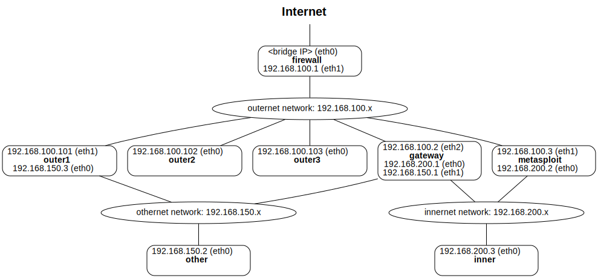

Docker Configuration
====================

[Go up to the NWS HW page](../index.html) ([md](../index.md))

### Overview

In this assignment you will configure your computer to use [Docker](https://en.wikipedia.org/wiki/Docker_(software)), which we will be using throughout this course.  Docker is an operating-system level virtual machine.  We have a configuration that we are expecting to work for all the homeworks in this course.  This docker setup has been tested on three platforms:

- Windows 10 with an x64 chip
- Mac OS X with an M2 chip
- Linux (Ubuntu 22.04) with an x64 chip

It worked fine on all three systems.  As those systems span the three operating systems in use, as well as the two major chip types in use, it is expected that it will work on your system as well.  **If you run into problems, please let us know.**

This assignment has very little in terms of the deliverable -- in fact, you could easily skip to the 'Submission' section, make up answers, and get full credit on this assignment.  HOWEVER, this assignment is going to be necessary to complete before doing *any other* assignment in this course, as pretty  much *all* the assignments will be using this docker setup.

### Changelog

Any changes to this page will be put here for easy reference.  Typo fixes and minor clarifications are not listed here.  So far there aren't any significant changes to report.


### Step 1: Pre-requisites

After reading the background, you should choose the setup particular to your operating system.  This tutorial assumes you have administrator (or `sudo`) access on your machine.


#### Background

Your computer is running a given operating system -- this is the *host* operating system.  Whatever else you run on your machine, that OS will always be the host.  When you run a virtual machine (VM), that VM may run a different OS -- and you may be running many of these at once.  These are called the *guests* (or guest OSes).  For docker, the guest OS is always Linux, even if you are running on a Windows host or a Mac host.

The way Docker works is you download or build an *image*.  An image is like a hard drive -- it has all the files necessary to boot a version of Linux, whether it be Ubuntu, Kali, Debian, or any other Linux flavor.  When you want to run such an image, you instruct docker to launch a *container*.  A container is just a running image.  From one image, you can have a dozen containers running.  You can also have containers of different images running as well.  So it is analogous to an executable file (the image) and a running process (the container) -- given a single executable file, you can have it running a dozen times, each time being a separate process.


#### Windows setup

If you are running Windows, you will need to install WSL (Windows Sub-system for Linux); you can see how to install that [here](https://learn.microsoft.com/en-us/windows/wsl/install)

Once you have installed WSL, you need to install the x11-server-utils package: `sudo apt update` followed by `sudo apt install x11-server-utils`.

#### Mac OS X setup

If you are running Mac OS X, you will need to install [Homebrew](https://brew.sh); the directions for how to install that are [here](https://docs.brew.sh/Installation).

One homebrew is installed, you should install two packages: `socat` and `xquartz`.  The commands to install these packages are: `brew install socat` and `brew install xquartz`.  Note that one of them (likely socat) needs to listen to network connections in the background; OS X will pop up a warning, although that may not occur until it is run.  The use of these two programs will be explained below.

#### Linux setup

No further installation steps are necessary.


### Step 2: Installation

Note that there are *two* things to install on this page -- don't forget the second one (docker-compose).

#### Install docker

The installation varies by operating system and chip type.  Docker is both the virtual machine software that we will be using, as well as company that helps to develop and market it.  Docker the company wants to sell you subscriptions and what-not, but that is not needed for what we will be using it for in this course.  THere is no need to create Docker accounts nor to pay anything.

The installation instructions are [here](https://docs.docker.com/engine/install/).

One installed, you can check to see if it works by running `docker pull hello-world` and then `docker run hello-world`.  You should see output similar to the following:

```
$ docker pull hello-world
Using default tag: latest
latest: Pulling from library/hello-world
478afc919002: Pull complete 
Digest: sha256:4bd78111b6914a99dbc560e6a20eab57ff6655aea4a80c50b0c5491968cbc2e6
Status: Downloaded newer image for hello-world:latest
docker.io/library/hello-world:latest

What's Next?
  View a summary of image vulnerabilities and recommendations → docker scout quickview hello-world

$ docker run hello-world

Hello from Docker!
This message shows that your installation appears to be working correctly.

To generate this message, Docker took the following steps:
 1. The Docker client contacted the Docker daemon.
 2. The Docker daemon pulled the "hello-world" image from the Docker Hub.
    (arm64v8)
 3. The Docker daemon created a new container from that image which runs the
    executable that produces the output you are currently reading.
 4. The Docker daemon streamed that output to the Docker client, which sent it
    to your terminal.

To try something more ambitious, you can run an Ubuntu container with:
 $ docker run -it ubuntu bash

Share images, automate workflows, and more with a free Docker ID:
 https://hub.docker.com/

For more examples and ideas, visit:
 https://docs.docker.com/get-started/

$ 
```

If that is not working properly for you, then you will need to fix that before you continue.

#### Install docker-compose

`docker-compose` is a command that makes it much easier to manage complicated docker setups.  It probably installed with the installation of Docker itself.  To check, run `docker-compose help`.  If you get "command not found", or similar, then you will need to install it -- you can see the installation instructions [here](https://docs.docker.com/compose/install/).


### Step 3: Configuration

A mini tutorial for how to use docker is coming shortly -- we first want to set up the course environment, which will give us something to work through for the mini tutorial.

#### Edit docker-compose.yml

Download the [docker-compose.yml](docker-compose.yml) file.  This file contains part of the course Docker setup.  Although it is quite long, it's not as complicated as it looks, but we'll get into that later.

You will need to configure that file for your particular setup:

1. Create a directory to hold your course materials.  This can be any directory, and any files that are in that directory will be visible (but read-only) when inside docker.  This will allow you to use your favorite editor, and then use the updated version of the program inside docker.  Make this anywhere you want; we'll call it `/path/to/cs4760/docker/` herein.
2. Edit the [docker-compose.yml](docker-compose.yml) file
   - The line `- DIRECTORY:/mnt:ro` appears throughout (a total of 8 tines).  You need to change `DIRECTORY` on that line to the the path from above.  This allows the various docker containers to see that directory.  In the example here, you would change it to `- /path/to/cs4760/docker/:/mnt:ro`.  Be sure to keep the initial `- ` before the line, as well as the indentation!  There also needs to be the `:ro` suffix (that makes the directory read-only so malware on the docker container cannot write to your files). You will want to do a global search-and-replace rather than changing each one by hand.
   - The line `- DISPLAY=MYDISP` also appears throughout (also 8 times).  This has to be changed based on the host operating system that is running on your computer.
   	 - Linux & Windows: Change that line to `- DISPLAY=:0`.  Again, be sure to keep the leading `- ` as well as the indentation
   	 - Mac OS X: You will need to change it to something such as `DISPLAY=192.168.1.100:0`, where `192.168.1.100` is your IP address.  Unfortunately, you will have to make this change if your IP address changes.  There are a few ways to find your IP address:
   	 	- Via `ifconfig`.   Your network interface is probably called `en0`, so you can run `ifconfig en0`.  You should see a line such as, `inet 192.168.1.100 netmask 0xffffff00 broadcast 192.168.1.255` -- the 192.168.1.100 is your IP address.
   	 	- Via system settings -> network -> wifi -> details (for the current wireless connection) -> TCP/IP.

#### Build the image

First, check to see what images are on your machine -- this is done via `docker images`.  You should see the following:

```
REPOSITORY                  TAG                 IMAGE ID       CREATED        SIZE
hello-world                 latest              ee301c921b8a   8 months ago   9.14kB
```

The hello-world image is what you used to test that your docker install worked.

There are two images that need to be built, and each has their own configuration file.  You will need to download both [Dockerfile](../../docker/Dockerfile) and [Dockerfile.metasploit2](../../docker/Dockerfile.metasploit2).  The [nws-exec.sh](../../docker/nws-exec.sh.html) ([src](../../docker/nws-exec.sh)) file must also be present, as it is needed to build the image.

There are four commands you need to enter, in succession, to build the course image:

- `docker pull ubuntu:22.04`: this downloads the Ubuntu:22.04 image, which is what the course image is based off of
- `docker pull tleemcjr/metasploitable2`: this downloads an intentionally vulnerable image which we are going to use to exploit
- `docker build -t metasploit2 -f Dockerfile.metasploit2 .`: this builds a variant of the intentionally vulnerable image so that it will work well in our setup
- `docker build -t nws .`: this builds the course image for the not-intentionally vulnerable images

One those completed, and assuming they completed successfully, you should run `docker images` again, and you will see something simnilar to the following:

```
$ docker images
REPOSITORY                  TAG                 IMAGE ID       CREATED        SIZE
metasploit2                 latest              930661a2090e   4 seconds ago   1.62GB
nws                         latest              c8a670c446df   4 minutes ago   2.81GB
ubuntu                      22.04               da935f064913   4 weeks ago     69.3MB
hello-world                 latest              ee301c921b8a   8 months ago    9.14kB
tleemcjr/metasploitable2    latest              db90cb788ea1   5 years ago     1.51GB
$
```

Your hash values (the "IMAGE ID" column), created dates, and sizes may vary.  All told, the images are taking up about 6 Gb of disk space.


### Step 4: Learn

We have a [docker reference](../../docker/index.html) ([md](../../docker/index.md)) available; the descriptions below will be using those commands.

You will be using docker extensively throughout the semester, so you should experiment with these commands.  There really isn't much you can break -- if you kill a few containers, just restart the setup via `docker-compose down` followed by `docker-compose up`.

#### Launch the containers

At this point, you have built the images, but nothing is running.  To run the images, you should enter: `docker-compose up`.  This will launch the course setup in a series of 8 docker containers.  The setup looks like the following; this looks complicated now, but it will all become clear in time.

[{style="width:50%"}](../../docker/network.svg)

#### Docker commands: creation and running

We have already seen a few commands to create the containers and start them running:

- `docker build` will build the images; this command requires other command-line parameters
- `docker-compose up` will start the containers running
- `docker pull <image>` will download an image, or will update an image

The new commands are:

- `docker-compose down` will stop the containers that are running.  You may be able to use Ctrl-C in your operating system as well, although the full command will do more clean-up than Ctrl-C does.  You would want to run this in another command window.

#### Docker commands: inspection

There are a few commands that you can use to see what is running, what images you have, etc.  The commands we have seen:

- `docker images` will show the images that you have either downloaded or built.  You may see some images that list as `<none>` -- these are images that are no longer necessary, but have not yet been deleted.

The new commands are:

- `docker ps -a` will show you which containers are running, as well as some other information about them.
- `docker network ls` will show what networks have been configured to work with the docker containers.  These are all software-based networks, running inside the docker engine.

#### Docker commands: clean-up

- `docker kill <cid>` will kill (stop) a container.  The `<cid>` - the container id -- is either the hash value in the left-most column when you run `docker ps -a`, or the container name in the right-most column when running `docker ps -a`
- `docker rm <cid>`: the previous command kills (stops) an image running, but does not remove it.  This command removes it; the `<cid>` is the same as the previous command.
- `docker rmi <id>`: this will remove the image (not the container!) from the system.  If that image is being used, such as in another image or in a running container, then it cannot be deleted.
- `docker system prune` will remove all stopped containers and all images that are no longer necessary.  Add the `-f` option if you don't want to have it prompt you each time.

If you experimented with these commands, you should re-launch the containers: `docker-compose down` and then `docker-compose up`.

#### docker exec

This is what this party is all about!  We can manipulate the images, but let's actually use them yet.

When the containers are running, you can connect to a container via `docker exec -it <image> /bin/bash`.  This is running a command (here `/bin/bash` -- the shell) on a given image (which is `<image>`).  The image name is either the left-most or right-most column of `docker ps -a`.  The `-it` command allows this docker exec command to be both interactive (`i`) and output to the terminal (`t`).

The hostnames are shown above in the diagram.  When connecting to an image, the images all have "nws-" prefixed.  Thus, to connect to outer1, you would use the image name `nws-outer1`.

Here is an example usage:

```
$ docker exec -it nws-outer1 /bin/bash
root@outer1:/# hostname
outer1
root@outer1:/# hostname -I
192.168.100.101 192.168.150.3 
root@outer1:/# ls /mnt/
file
root@outer1:/# exit
exit
$
```

This connected to outer1, and ran a few commands therein to see the hostname and the IP addresses.  The last command, `ls /mnt` looked at the files in `/mnt`, which is mapped to the directory you created and chose above (in step 3: `/path/to/cs4760/docker/`).

We will be using this command a lot, including later in this tutorial.

#### Other commands

If you have a [Docker Hub](https://hub.docker.com) account (not necessary for this course), you can run `docker login`.  This is the place where `docker pull` pulls the images from.  Note that logging in is not necessary.  If you want to login to another docker repository, you would use `docker login server:5000`.

If you want to copy a file to or from a container, you would use `docker cp`.  Note that if you have a file in your `/path/to/cs4760/docker/` directory, then you don't need to copy it into the container.

- `docker cp <filename> <cid>:/path/to/<filename>` will copy the file named `<filename>` into the container `<cid>` into the `/path/to/` directory.  Replace `<cid>` with the container ID, as above.  Replace `/path/to/` with wherever you want to put it in the container.
- `docker cp <cid>:/path/to/<filename> .` will copy a file *from* a container into the current directory.
	

### Step 5: GUI

Command-line is great, but we also want to be able to run GUI programs from Docker.  The directions for this vary by operating system, and are also included on the [docker reference](../../docker/index.html) ([md](../../docker/index.md)) page.  Note that most of the "one-time installation" steps on that page have already been run.

#### Mac OS X

Running a GUI from docker is a bit challenging in OS X.  Docker can't directly access the display, so we have to send the GUI over a docker network to the host machine; this is what the `socat` and `xquartz` programs, that you installed above, are used for.

You will have to log out and then log back in (or restart) after you installed xquartz, and before you do this step (part of xquartz runs in the background, and that is only started on a login).

- Make sure the docker engine is running -- you should see a docker icon in the top bar (it looks like a container ship).
- Launch socat from the command line:
    - `socat TCP-LISTEN:6000,reuseaddr,fork UNIX-CLIENT:\"$DISPLAY\"`
	- You can put it in the background by appending `&` to it
- Run xquartz: `open -a Xquartz`
	- The first time xquartz launches, go do XQuartz -> Settings -> Security, and make sure "Allow connections from network clients" is checked
- One of these two will give a warning 
- Make sure the value of the DISPLAY variable in docker-compose.yml is set to your IP (plus `:0`)
	- This is your IP on your local network: enter `ifconfig en0` to find out what it is
	- Be sure to put the `:0` at the end of the IP address
	- Example: `DISPLAY=192.168.14.45:0` (with a `- ` before it in the docker-compose.yml file)
	- You should change this, via find-and-replace, throughout the entire docker-compose.yml file
	- If you made a change to the docker-compose.yml file, restart the containers
- Connect to a docker container (any one), and run the gui program, such as `xeyes`.

The [docker reference](../../docker/index.html) ([md](../../docker/index.md)) page lists a number of troubleshooting tips to try if things are not working correctly.

When you are done, the commands to shut down xquartz and socat are:

- From the XQuartz menu, click on "Quit X11"
- Terminate socat: `killall -9 socat`

You can also quit the docker engine, if desired.

#### Linux

- Run `xhost +local:docker` on your host
- Make sure the value of the DISPLAY variable in docker-compose.yml is just `:0`
	- Example: `DISPLAY=:0`, with the `- ` preceeding it
	- You should change this, via find-and-replace, throughout the entire docker-compose.yml file
	- If you made a change to the docker-compose.yml file, restart the containers
- Connect to a docker container (any one), and run the gui program, such as `xeyes`.

When shutting down, you can remove the xhost permission (via `xhost -local:docker`), but it does not seem to be a security issue if you leave it as-is.

#### Windows

- Start the Docker engine -- it's the "Docker Desktop" entry in Programs
	- WSL can't use docker unless this is running
- Launch WSL; all further commands in this part are in WSL
- From this point, the directions are the same as the "Running the GUI" directions in Linux, since WSL provides a Linux shell:
	- Run `xhost +local:docker` on your host
	- Make sure the value of the DISPLAY variable in docker-compose.yml is just `:0`
		- Example: `DISPLAY=:0`, with the `- ` preceeding it
		- You should change this, via find-and-replace, throughout the entire docker-compose.yml file
		- If you made a change to the docker-compose.yml file, restart the containers
	- Connect to a docker container (any one), and run the gui program, such as `xeyes`.

To shut down, in WSL, you can remove the xhost permission (via `xhost -local:docker`), but it does not seem to be a security issue if you leave it as-is.  You can also quit the docker engine, if desired.


### Step 6: Exploit

We are going to exploit a vulnerability in vsftp 2.3.4; this is [CVE 2011-2523](https://www.cve.org/CVERecord?id=CVE-2011-2523).  This had a CVE score of 10.0, which is the highest level of vulnerability that exists.

FTP, which stands for file transfer protocol, is a means of efficiently transferring files from a server to a client.  While it's mostly been replaced by http and https these days, you will still find it around, as it is more efficient than http.  

There were many implementations of the FTP server, and vsFTPd ("Very Secure FTP Daemon") is a GPL (meaning open-source) implementation of an FTP server.  Sometime in 2011, an unknown person put in a back door into the vsftp code where any username that ends with `:)`, followed by any password, will open up a backdoor on port 6200.

The metasploit container has this vulnerability.

To exploit it:

- Connect to any container; we'll use outer1 in this example: `docker exec -it nws-outer1 /bin/bash`.  You should connect twice, in 2 different windows.
- Ensure that port 6200 on the metasploit container is closed by running `nmap -p 6200 metasploit`.  We'll see nmap in more detail later, but it should say "closed" in the output of namp next to the port 6200 entry.
- Exploit the vulnerability: try to connect to that machine via `ftp metasploit`.  Enter any username, but have the username end with `:)`; enter any password.
	- After you enter the password, it will appear to hang for around a minute -- you can go to the next step as soon as you enter the password; you don't have to wait.
- In the other shell, check to see that port 6200 (the backdoor) is now open: `nmap -p 6200 metasploit`
- Connect to that backdoor via `nc metasploit 6200`.  `nc`, also called netcat, is a low-level program to send and receive TCP data.
- You can now enter commands into the backdoor, which will be executed on the metasploit container.  A few to try:
	- `whoami` shows that these commands are executing as root
	- `ls` shows the various files
	- `cat /etc/ssh/ssh_host_rsa_key.pub` prints the *private* key of that machine
- When all done, hit Ctrl-C to exit nc

If you are interested in seeing how this works (not necessary for this assignment), see [this page](https://westoahu.hawaii.edu/cyber/forensics-weekly-executive-summmaries/8424-2/), under the "Why It Works" header.  Lines 12 and 13 check if the last two characters are `:` and `)`, and then -- if they are -- launches the backdoor via the `vsf_sysutil_extra()` function call.

### Submission

You will be submitting an edited version of the [docker.py](docker.py.html) ([src](docker.py)).  The comments therein explain what you should fill in.  We are interested in honest answers, not [sycophantic](https://www.merriam-webster.com/dictionary/sycophantic) answers.  The assignment is auto-graded, so you will get full credit as long as you fill in the values in that file correctly.

That file is the only file you should submit to Gradescope.


